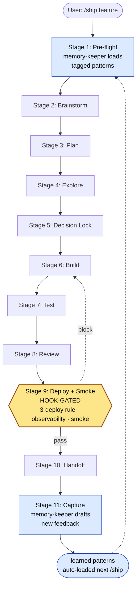

# claude-config

**A power-user Claude Code setup — 36 skills, 14 agents, 21 hooks, built around a memory-aware ship pipeline.**

   
<!-- Social preview card: assets/og-card.png (1200x630). Uploaded manually via repo Settings > Social preview. -->

A snapshot of [Molly Shelestak](https://github.com/molly-diversifiedfun)'s working `~/.claude/` config, sanitized for public reference. Power users + Claude Code builders are the audience — not beginners.

## What you get

- **A memory-aware `/ship` pipeline** that loads tagged learnings from past sessions before a feature starts and captures new feedback when it ends. Stops the same mistake recurring across projects.
- **A 14-agent product team** (PM / engineer / reviewer / debugger / security / etc.) wired to specific models with specific skill palettes — no more "which agent do I spawn for this?"
- **21 lifecycle hooks that enforce discipline**: block dangerous deletes, gate `/ship` deploys, log every Skill + Agent invocation for telemetry, refuse to end a session if the Definition of Done isn't met.

---

## TL;DR — grab one piece (60 seconds)

Want the telemetry hook that logs every Skill + Agent invocation to `~/.claude/checkpoints/activity.jsonl`?

```sh
curl -sL https://raw.githubusercontent.com/molly-diversifiedfun/claude-config-public/main/hooks/observe-learning.sh \
  -o ~/.claude/hooks/observe-learning.sh && chmod +x ~/.claude/hooks/observe-learning.sh
```

Then wire it in `~/.claude/settings.json`:

```jsonc
{ "hooks": {
    "PreToolUse":  [{"matcher": "*", "hooks": [{"command": "$HOME/.claude/hooks/observe-learning.sh pre"}]}],
    "PostToolUse": [{"matcher": "*", "hooks": [{"command": "$HOME/.claude/hooks/observe-learning.sh post"}]}]
}}
```

That's it. Same pattern for any other hook (`block-dangerous.sh`, `session-retrospective.sh`, etc.) or any skill/agent.

For the full system, [jump to Quick Start →](#quick-start-full-install)

---

## Proof it works

The hooks aren't theory. Real outputs from a recent session:

**`observe-learning.sh` capturing skill names in `activity.jsonl`:**

```
{"ts":"2026-05-12T00:21:36-0400","phase":"pre","tool":"Skill","file":"handoff","project":"/Users/.../nancy"}
{"ts":"2026-05-12T00:21:37-0400","phase":"post","tool":"Skill","file":"handoff","project":"/Users/.../nancy"}
{"ts":"2026-05-11T23:21:45-0400","phase":"post","tool":"Agent","file":"general-purpose","project":"/Users/.../sidekick"}
```

Every Skill invocation, every subagent dispatch, with timestamps. Re-runnable audits become trivial.

**`session-retrospective.sh` blocking session-end on incomplete DoD:**

```
Stop hook blocking: "Running session retrospective..."
DoD INCOMPLETE: HANDOFF.md not updated today.
TASKS.md not updated today (298 tool uses in session).
No learnings saved to memory (298 tool uses).
Walk the Definition of Done (rules/common/definition-of-done.md) before ending session.
```

This actually fires. A 298-tool-use session would have ended without a handoff, without saved learnings, without tracker updates. The hook caught it. Next session resumes cleanly because of this.

**`block-dangerous.sh` allowing legit deletes, blocking catastrophic ones (11/11 test cases):**

```
PASS  specific-abs-path      -> allowed
PASS  specific-tilde         -> allowed
PASS  relative-path          -> allowed
PASS  bare-root              -> blocked
PASS  root-glob              -> blocked
PASS  bare-home              -> blocked
PASS  home-glob              -> blocked
PASS  git push --force       -> blocked
```

Test harness ships at `/tmp/test-block-dangerous.sh` (in commit `d2a6418`). The hook tightening came from a real session where the previous prefix-match version blocked legitimate `rm -rf /Users/.../skills/foo` deletes.

**One workstation, 21,000+ tool invocations logged:** the `activity.jsonl` file on the author's laptop currently holds **21,000+ entries** across every Skill invocation, every subagent dispatch, every Bash call — captured by `observe-learning.sh` since the hook was wired. Telemetry isn't a slide; it's the substrate this config is built on.

---

## Why this exists

> One specific incident drove the most distinctive safety pattern:
>
> `bin/sync.sh` is one-way (`~/.claude/` → repo). I once edited 14 files on the **repo side** during a refactor. Ran sync. Every edit was silently reverted — sync just rsync'd the still-stale live copies on top. The repo files showed as Modified for a moment, then matched HEAD again. Twenty minutes of cleanup, then redo on the live side.
>
> The fix is in `feedback_live_first_sync_discipline.md` (private memory, distilled into the `learned/` patterns this repo ships). The lesson: **edit live first, sync, commit**. Now it's a memory-loaded reminder for every future `/ship` run in any project — the kind of cross-project learning the original config is designed to compound.

Every hook, every learned pattern, every agent definition has a story like this behind it. The repo is the artifact; the discipline is what makes it work.

---

## What's inside

| Folder | What | Count |
|---|---|---|
| `agents/` | Custom subagents — specialist roles (PM, engineer, reviewer, debugger, security, etc.) | 14 |
| `commands/` | Slash commands (`/fix`, `/build`, `/ship`, `/write`, `/escalate-to`, `/plan`, etc.) | 18 |
| `skills/` | Custom skills (auto-invoked via the Skill tool when their description matches the prompt) | 36 |
| `rules/` | Coding / git / testing / security rules + CARL domain configs | 11 files |
| `hooks/` | Shell scripts wired into the Claude Code lifecycle | 21 |
| `scripts/` | Runtime utilities (frontmatter validator, ship-phase-gate test harness, hook registrar) | 4 |
| `docs/` | Architecture, ship-pipeline-v2 spec, skills/agents/commands catalogs, install guide | 8 |
| `CLAUDE.md` | Global instructions that auto-load every session | 1 |
| `bin/` | `install.sh`, `sync.sh`, `bootstrap.sh`, `sanitize-for-public.sh` | 4 |

**Not included** (intentionally): `settings.json` (secrets), `projects/` (per-project memory), `HANDOFF.md` / `TASKS.md` / `.ship/` (session-specific), `skills/brand-voice-router/` (was brand-specific — ships as a template stub), `rules/content-system/` (brand content pipeline).

---

## The 5-mode workflow

```
USER REQUEST
    │
    ├─ /fix           → quick patch, no spec, single edit
    ├─ /build         → spec → 3-5 agents → review → tests → ship
    ├─ /ship          → MEMORY-AWARE 11-stage pipeline
    │                    pre-flight: memory-keeper loads tagged patterns
    │                    stages 2-8:  9 agents
    │                    stage  9:    deploy + smoke (hook-gated)
    │                    capture:     new feedback → learned/
    ├─ /write         → content with brand voice
    └─ /escalate-to   → mode transition mid-task
```

Full architecture in [`docs/architecture.md`](docs/architecture.md). Ship pipeline detail in [`docs/ship-pipeline-v2.md`](docs/ship-pipeline-v2.md).


### The `/ship` 11-stage pipeline (memory-aware)



The blue stages are owned by `memory-keeper` (Haiku). The amber Stage 9 is the only one a hook currently gates end-to-end — Phase B will gate Stages 5, 7, and 10. The dotted feedback loop is what makes this compound: every shipped feature deposits a learning the *next* feature pre-loads.

---

## The interesting parts

- **[`docs/ship-pipeline-v2.md`](docs/ship-pipeline-v2.md)** — A memory-aware 11-stage feature pipeline that loads tagged learnings into a `patterns.md` manifest at pre-flight, gates Stage 9 (Deploy + Smoke) with a hook enforcing the 3-deploy rule + observability + smoke-test sections, and captures new feedback at post-flight.
- **`hooks/`** — Lifecycle scripts that enforce discipline. `session-retrospective.sh` (Stop, 7-check DoD), `block-dangerous.sh` (PreToolUse:Bash, regex-tightened), `observe-learning.sh` (telemetry), `agent-batch-validator.sh` (≤4 file paths per Agent prompt), `ship-phase-gate.sh` (gates `/ship` Stage 9), `carl-loader.sh` (CARL rule injection).
- **`skills/learned/`** — 16 cross-project patterns synthesized from session feedback. v2 frontmatter (`applies-to`, `projects`, `severity`, `phase`) so the ship-pipeline can filter-load them. Start with `systematic-shortcutting.md`, `verify-before-commit.md`, `deploy-iteration-discipline.md`.
- **The 14 agents** — `product-lead` (opus) plans, `engineer` (sonnet) builds, `reviewer` (sonnet) reviews, `designer` (sonnet) does UI/UX, `debugger` (opus) investigates, `tech-researcher` (sonnet) checks docs, `security` (opus) audits, `project-manager` (haiku) tracks, `memory-keeper` (haiku) owns ship-pipeline Stage 1 + 11, 4 `content-*` agents (lanes), `market-researcher` (sales/market intel).

---

## Quick start — full install

> **⚠️ If you already have a `~/.claude/` setup, back it up first.** `bin/install.sh` uses `rsync --delete` on `~/.claude/{skills,agents,commands,rules,hooks,scripts}` — files in those dirs that aren't in this repo will be removed. The script prompts before overwriting, but a backup is the right insurance.
>
> ```sh
> cp -R ~/.claude ~/.claude.backup-$(date +%Y%m%d)
> ```

```sh
# 1. Clone somewhere safe (NOT directly to ~/.claude/)
git clone https://github.com/molly-diversifiedfun/claude-config-public ~/code/claude-config-public
cd ~/code/claude-config-public

# 2. Read the architecture before installing anything
$EDITOR docs/architecture.md docs/ship-pipeline-v2.md

# 3. Read install.sh, then run it
$EDITOR bin/install.sh
./bin/install.sh           # prompts before overwriting; use --yes to skip prompt
```

`bin/install.sh` will:
- **Sync (rsync --delete)** `agents/`, `commands/`, `rules/`, `hooks/`, `scripts/`, `skills/` into `~/.claude/` — overwriting existing content in those dirs
- **Copy** `CLAUDE.md` to `~/.claude/`
- **Skip** `settings.json` (has secrets), `projects/` (per-project memory), `settings.local.json` (this snapshot doesn't ship one)
- Leave `sessions/`, `cache/`, `telemetry/`, `backups/` alone

`bin/bootstrap.sh` is a heavier one-shot for a **fresh Mac** — installs Claude Code, runs `install.sh`, writes a baseline `settings.json`, prompts for OAuth login, bulk-installs plugins. macOS + Homebrew assumed.

After install, see [`CHECKLIST.md`](CHECKLIST.md) for manual steps that can't be scripted (MCP server registration, plugin OAuth flows, API keys per skill).

---

## Customizing

Every reference to `<your brand>`, `<your-project-1>`, `<your-content-brand>`, etc., is a placeholder where personal content was stripped. Replace with your own.

The `learned/` patterns reference personal feedback file names (e.g. `feedback_session_<project>_learnings.md`). Those files aren't in this repo (they were in the private memory dir) but the references stay as breadcrumbs showing the source-of-truth pattern: cross-project learnings get distilled from session feedback into `learned/` over time.

---

## Conventions you'll need to understand

- **CARL** — A domain-rule injection system. See `hooks/carl-loader.sh` and `rules/common/`. The `*dev`, `*review`, `*brief` star-commands invoke specific rule domains.
- **Ship-pipeline v2** — `/ship` is memory-aware. Pre-flight loads tagged memory files. Stage 9 has a hook gate. Stage 11 captures new feedback. Full spec in `docs/ship-pipeline-v2.md`.
- **Live-first sync discipline** — `bin/sync.sh` is one-way (`~/.claude/` → repo). Edit live first, then sync. See the "Why this exists" section above for the failure mode that drove this rule.

---

## What's NOT for the faint of heart

- Hooks enforce a strict DoD. Sessions are blocked from ending if HANDOFF.md / TASKS.md / memory aren't updated. To disable, comment out the `Stop` hook in `~/.claude/settings.json` after install.
- `block-dangerous.sh` blocks force-pushes, sudo, root-level `rm -rf`, and `curl | sh`. If you actually need to push --force, run it outside the session or edit the hook.
- `agent-batch-validator.sh` caps file path refs in Agent prompts at 4. Forces you to write "grep for X" instead of listing 10 files.
- The 16 `learned/` patterns are opinionated. Read them; disagree where you disagree; delete what doesn't fit you.

---

## Share

If this saved you a setup pass, a one-line credit is appreciated but not required. Example tweet:

> Just installed [@moleonthego](https://twitter.com/moleonthego)'s `claude-config-public` — 36 skills, 14 agents, 21 hooks, and a memory-aware `/ship` pipeline that won't let you end a session without a HANDOFF. Worth a read if you live in Claude Code.
>
> https://github.com/molly-diversifiedfun/claude-config-public

<!--
TWEET TEMPLATE — paste-ready. Customize first sentence:

"Just installed @moleonthego's claude-config-public — 36 skills, 14 agents, 21 hooks, and a memory-aware /ship pipeline that won't let you end a session without a HANDOFF. Worth a read if you live in Claude Code.

https://github.com/molly-diversifiedfun/claude-config-public"

LINKEDIN TEMPLATE — slightly longer form:

"If you're already a Claude Code power user, Molly Shelestak (@moleonthego on X) just open-sourced her working config. 36 skills, 14 agents, 21 lifecycle hooks, and a memory-aware /ship pipeline that loads tagged learnings from prior sessions before a feature starts. Snapshot — not maintained — so cherry-pick what fits.

https://github.com/molly-diversifiedfun/claude-config-public"
-->

## License

MIT. Attribution appreciated but not required.

## Provenance

Snapshot of Molly Shelestak's working Claude Code config on 2026-05-12. Generated via `bin/sanitize-for-public.sh` from the private mirror. **No commitment to ongoing sync** — this is v1.0 and may be updated periodically or never.

The companion public skill marketplace lives at [claude-skills](https://github.com/molly-diversifiedfun/claude-skills).
